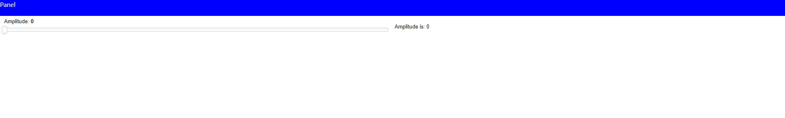

# panel-pyodide-experiments

A repository for experimentation with Panel and Pyodide/ Pyscript

## Experiment 1: A `panel-fast-template` web component to make it easier to quickly create nicely styled Panel apps with Pyodide and Pyscript

Work in progress. I'm capable of creating the web component. Next Step would be to add the Fast `.html`, `.css` and `.js`.

